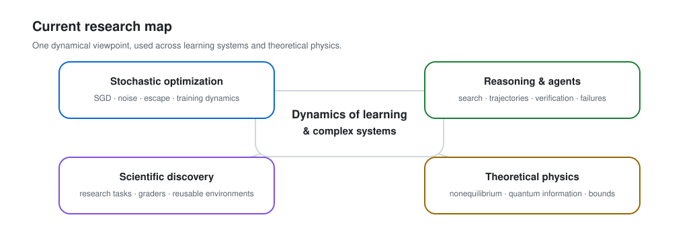

# Kangqiao Liu

I work on **stochastic learning dynamics** and theoretical models of complex systems. My earlier machine-learning research studied finite-learning-rate SGD, minibatch noise, and escape dynamics. I now work across learning dynamics, nonequilibrium physics, quantum information, and increasingly on reasoning and scientific AI.

<picture>
  <source media="(prefers-color-scheme: dark)" srcset="assets/research-trajectory-dark.svg">
  <source media="(prefers-color-scheme: light)" srcset="assets/research-trajectory-light.svg">
  
</picture>

## Selected machine-learning work

| Work | Venue | Main idea |
|---|---|---|
| [Noise and Fluctuation of Finite Learning Rate SGD](http://proceedings.mlr.press/v139/liu21ad.html) | **ICML 2021** | Discrete-time theory of SGD noise and parameter fluctuations at finite learning rate |
| [Strength of Minibatch Noise in SGD](https://openreview.net/forum?id=uorVGbWV5sw) | **ICLR 2022 Spotlight** | Structure and strength of minibatch noise beyond infinitesimal-step approximations |
| [Power-law Escape Rate of SGD](https://proceedings.mlr.press/v162/mori22a.html) | **ICML 2022 Spotlight** | Stationary distributions and power-law escape from local minima |

## What I am working toward

<picture>
  <source media="(prefers-color-scheme: dark)" srcset="assets/research-map-dark.svg">
  <source media="(prefers-color-scheme: light)" srcset="assets/research-map-light.svg">
  
</picture>

The next part of my research is about bringing a dynamical-systems viewpoint to modern learning and reasoning: trajectory ensembles, search, verification, rare failures, compute allocation, and research environments built from genuine mathematical and physical problems.

I am especially interested in work where the central result is a mechanism or a reusable scientific object, rather than an application built around a particular model generation.

## Research software and reproducibility

- **[Scientific Manuscript Audit](https://github.com/KangqiaoLiu/scientific-manuscript-audit)** — a claim-centered audit workflow for Codex and Claude Code, with synthetic evaluation cases and automated validation.
- **[Two-Qubit Daemonic Ergotropy](https://github.com/KangqiaoLiu/Daemonic_ergotropy_twoqubit)** — code and numerical outputs for reproducing analytical and numerical results in quantum-information thermodynamics.

## Elsewhere

[Personal website](https://kangqiaoliu.github.io/) · [AI Research CV](https://kangqiaoliu.github.io/ai-cv/) · [AI Research CV (PDF)](https://kangqiaoliu.github.io/files/Kangqiao_Liu_AI_Research_CV.pdf) · [Google Scholar](https://scholar.google.com/citations?user=utIJkHcAAAAJ&hl=en) · [ORCID](https://orcid.org/0000-0002-4014-5728)
